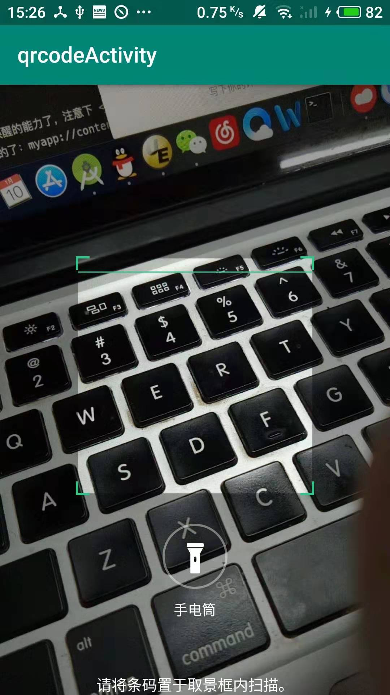

# android-qrcode
基于ZXing-Android-Embedded实现自定义二维码风格，仿微信双击放大缩小，两指放大缩小，闪光灯，去红线自定义扫描线及边角 
###前言： 
网上也有非常多基于二维码zxing实现自定义需求，但是搜索了一大圈，都没找到自己想要的那种效果，本文基于综合各大大神资料，自己绘制了一个实现zxing二维码，仿微信实现了双击放大缩小，二维码边角，及去除ZXing Android Embedded原生红线效果，仿微信绘制了线条滚动效果。
 ###eg 

 ###导入aar 
  implementation ('com.journeyapps:zxing-android-embedded:3.6.0'){ transitive = false }
  implementation 'com.google.zxing:core:3.3.2' 
  implementation 'com.tbruyelle.rxpermissions2:rxpermissions:0.9.4@aar'

 ###代码 
 ####1.闪光灯 

    private CompoundBarcodeView barcodeView;
        @Override
    protected void onCreate(Bundle savedInstanceState) {
        super.onCreate(savedInstanceState);
        setContentView(R.layout.qrcode);
        .....
        barcodeView = (CompoundBarcodeView) findViewById(R.id.barcode_scanner);
 		 ....
   		flashlight.setOnClickListener(v -> {
            if (isLightOn) {
          		//闪光灯关闭
                barcodeView.setTorchOff();
                flashlight.setImageResource(R.drawable.light_close);
            } else {
            		//闪光灯打开
                barcodeView.setTorchOn();
                flashlight.setImageResource(R.drawable.light_open);
            }
            isLightOn = !isLightOn;
        });
        // 如果没有闪光灯功能，就去掉相关按钮
        if (!hasFlash()) {
            flashlight.setVisibility(View.GONE);
        }

    }
这里主要调用zxing已经给我们写好的接口CompoundBarcodeView下的接口barcodeView.setTorchOn和Off，我们直接引用就可以了。
 ####2.四个边角框 
我们看ZXing Android Embedded源码可以知道，我们可以重写DecoratedBarcodeView类的R.layout.zxing_barcode_scanner的布局

	/**
     * Initialize the view with the xml configuration based on styleable attributes.
     *
     * @param attrs The attributes to use on view.
     */
    private void initialize(AttributeSet attrs) {
        // Get attributes set on view
        TypedArray attributes = getContext().obtainStyledAttributes(attrs, R.styleable.zxing_view);

        int scannerLayout = attributes.getResourceId(
                R.styleable.zxing_view_zxing_scanner_layout, R.layout.zxing_barcode_scanner);

        attributes.recycle();

        inflate(getContext(), scannerLayout, this);

        barcodeView = (BarcodeView) findViewById(R.id.zxing_barcode_surface);

        if (barcodeView == null) {
            throw new IllegalArgumentException(
                "There is no a com.journeyapps.barcodescanner.BarcodeView on provided layout " +
                "with the id \"zxing_barcode_surface\
点开之类，我写上备注

	<merge xmlns:android="http://schemas.android.com/apk/res/			android">
		//ScaleBarcodeView 这个对应修改整个背景不分（例如放大缩小）
    <com.example.qrcodeactivity.qrcode.ScaleBarcodeView
        android:id="@+id/zxing_barcode_surface"
        android:layout_width="match_parent"
        android:layout_height="match_parent" />
	//CustomViewFinderView 这个对应修改扫描框（例如边角，红线部分）
    <com.example.qrcodeactivity.qrcode.CustomViewFinderView
        android:id="@+id/zxing_viewfinder_view"
        android:layout_width="match_parent"
        android:layout_height="match_parent" />
    //底部自定义文字
    <TextView
        android:id="@+id/zxing_status_view"
        android:layout_width="wrap_content"
        android:layout_height="wrap_content"
        android:layout_gravity="bottom|center_horizontal"
        android:background="@color/zxing_transparent"
        android:text="@string/zxing_msg_default_status"
        android:textColor="@color/zxing_status_text" />
	</merge>
这里我们要实现去红线和四个角，所以我们要继承ViewfinderView重写ondraw部分代码
	
		/**
	 * desc:重写扫描框类
	 * author：ccw
	 * date:2019-12-27
	 * time:22:45
		 */
	public class CustomViewFinderView extends ViewfinderView {
    private int screenWidth = 0;
    private int screenHeight = 0;
    private RectF buttonRect;
    private String text_btn = "个性化需求";
    /**
     * 重绘时间间隔
     */
    private static long CUSTOME_ANIMATION_DELAY = 16;
    /**
     * 边角线颜色
     */

    private int mLineColor = getContext().getResources().getColor(R.color.c_a_green);
    /**
     * 线性梯度各个位置对应的颜色值
     */
    private Rect nowScanRect;
    /**
     * 边角线厚度 (建议使用dp)
     */

    private float mLineDepth = TypedValue.applyDimension(TypedValue.COMPLEX_UNIT_DIP, 2f, getResources().getDisplayMetrics());
    /**
     * "边角线长度/扫描边框长度"的占比 (比例越大，线越长)
     */

    private float mLineRate = 0.05f;
    /**
     * 扫描线起始位置
     */

    private int mScanLinePosition = 0;
    /**
     * 扫描线每次重绘的移动距离
     */

    private float mScanLineDy = TypedValue.applyDimension(TypedValue.COMPLEX_UNIT_DIP, 3f, getResources().getDisplayMetrics());

    /**
     * 线性梯度
     */
    private LinearGradient mLinearGradient;
    /**
     * 线性梯度位置
     */

    private float[] mPositions = {0f, 0.5f, 1f};

    /**
     * 扫描线厚度
     */

    private float mScanLineDepth = TypedValue.applyDimension(TypedValue.COMPLEX_UNIT_DIP, 1f, getResources().getDisplayMetrics());
    //扫描线渐变色
    private int laserColor_center = getContext().getResources().getColor(R.color.c_a_green);

    private int laserColor_light = getContext().getResources().getColor(R.color.c_a_green);

    private int[] mScanLineColor = {laserColor_light, laserColor_center, laserColor_light};

    private float mDist = 0;

    public CustomViewFinderView(Context context, AttributeSet attrs) {
        super(context, attrs);
        init();
    }

    private void init() {
        WindowManager windowManager = ((Activity) getContext()).getWindowManager();
        DisplayMetrics displayMetrics = new DisplayMetrics();
        windowManager.getDefaultDisplay().getMetrics(displayMetrics);
        screenWidth = displayMetrics.widthPixels;
        screenHeight = displayMetrics.heightPixels;
        int w = screenWidth * 3 / 5;
        int marginL = screenWidth / 5;
        int marginT = screenHeight / 4;
        nowScanRect = new Rect(marginL, marginT, w + marginL, w + marginT);
    }

    @SuppressLint("DrawAllocation")
    @Override
    public void onDraw(Canvas canvas) {
        refreshSizes();
        if (framingRect == null || previewFramingRect == null) {
            return;
        }
        Rect frame = nowScanRect;
      //  Rect frame =  cameraPreview.getFramingRect();
        Rect previewFrame = previewFramingRect;
        int width = canvas.getWidth();
        int height = canvas.getHeight();
        if (resultBitmap != null) {
            paint.setColor(resultColor);
        } else {
            paint.setColor(maskColor);
        }

        canvas.drawRect(0f, 0f, width, frame.top, paint);
        canvas.drawRect(0f, frame.top, frame.left, (frame.bottom + 1), paint);
        canvas.drawRect((frame.right + 1), frame.top, width, (frame.bottom + 1), paint);
        canvas.drawRect(0f, (frame.bottom + 1), width, height, paint);

        //  drawText(canvas, frame)

      //  drawButton(canvas, frame);
        ////绘制4个角
        paint.setColor(mLineColor);
		//
		// 定义画笔的颜色
        //左上-横线
        canvas.drawRect(frame.left - mLineDepth,
                frame.top - mLineDepth,
                frame.left + frame.width() * mLineRate,
                frame.top, paint);
        //左上-纵线
        canvas.drawRect(frame.left - mLineDepth, frame.top, frame.left, frame.top + frame.height() * mLineRate, paint);
        //右上-横线
        canvas.drawRect(frame.right - frame.width() * mLineRate, frame.top - mLineDepth, frame.right + mLineDepth, frame.top, paint);
        //右上-纵线
        canvas.drawRect(frame.right, frame.top - mLineDepth, frame.right + mLineDepth, frame.top + frame.height() * mLineRate, paint);
        //左下-横线
        canvas.drawRect(frame.left - mLineDepth, frame.bottom, frame.left + frame.width() * mLineRate, frame.bottom + mLineDepth, paint);
        //左下-纵线
        canvas.drawRect(frame.left - mLineDepth, frame.bottom - frame.height() * mLineRate, frame.left, frame.bottom, paint);
        //右下-横线
        canvas.drawRect(frame.right - frame.width() * mLineRate, frame.bottom, frame.right + mLineDepth, frame.bottom + mLineDepth, paint);
        //右下-纵线
        canvas.drawRect(frame.right, frame.bottom - frame.height() * mLineRate, frame.right + mLineDepth, frame.bottom + mLineDepth, paint);
        if (resultBitmap != null) {
            paint.setAlpha(ViewfinderView.CURRENT_POINT_OPACITY);
            canvas.drawBitmap(resultBitmap, null, frame, paint);
        } else {
            //  drawLaserLine(canvas,frame)
            // 绘制扫描线
            mScanLinePosition += mScanLineDy;
            if (mScanLinePosition > frame.height()) {
                mScanLinePosition = 0;
            }

            mLinearGradient = new LinearGradient(frame.left, (frame.top + mScanLinePosition), frame.right, (frame.top + mScanLinePosition), mScanLineColor, mPositions, Shader.TileMode.CLAMP);

            paint.setShader(mLinearGradient);

            canvas.drawRect(frame.left, (frame.top + mScanLinePosition), frame.right, frame.top + mScanLinePosition + mScanLineDepth, paint);

            paint.setShader(null);

            int scaleX = frame.width() / previewFrame.width();
            int scaleY = frame.height() / previewFrame.height();
            List<ResultPoint> currentPossible = possibleResultPoints;
            List<ResultPoint> currentLast = lastPossibleResultPoints;
            int frameLeft = frame.left;
            int frameTop = frame.top;
            if (currentPossible.isEmpty()) {
                lastPossibleResultPoints=null;
            } else {
                possibleResultPoints = new ArrayList(5);

                lastPossibleResultPoints = currentPossible;

                paint.setAlpha(ViewfinderView.CURRENT_POINT_OPACITY);
                paint.setColor(resultPointColor);
                for (ResultPoint point : currentPossible) {
                    canvas.drawCircle((frameLeft + (point.getX() * scaleX)), (frameTop + (point.getY() * scaleY)), ViewfinderView.POINT_SIZE, paint);
                }

            }

            if (currentLast != null) {
                paint.setAlpha(ViewfinderView.CURRENT_POINT_OPACITY / 2);

                paint.setColor(resultPointColor);

                float radius = ViewfinderView.POINT_SIZE / 2.0f;

                for (ResultPoint point : currentLast) {
                    canvas.drawCircle((frameLeft + (point.getX() * scaleX)), (frameTop + (point.getY() * scaleY)), radius, paint);
                }

            }

        }// Request another update at the animation interval, but only repaint the laser line, // not the entire viewfinde

	// rmask.
        postInvalidateDelayed(CUSTOME_ANIMATION_DELAY, frame.left, frame.top, frame.right, frame.bottom);

    }

    private void drawButton(Canvas canvas, Rect mScanRect) {
        Paint buttonPaint = new Paint();
        buttonPaint.setAntiAlias(true);
        buttonPaint.setColor(getContext().getResources().getColor(R.color.c_white));
        buttonPaint.setStrokeWidth(1f);
        buttonPaint.setStyle(Paint.Style.STROKE);

        int height = CommonUtils.dp2px(getContext(), 40);

        int left = mScanRect.left + (mScanRect.right - mScanRect.left) / 6;

        int top = mScanRect.bottom + CommonUtils.dp2px(getContext(), 48);

        int right = mScanRect.right - (mScanRect.right - mScanRect.left) / 6;

        int bottom = mScanRect.bottom + CommonUtils.dp2px(getContext(), 48) + height;

        buttonRect = new RectF(left, top, right, bottom);
        canvas.drawRoundRect(buttonRect, CommonUtils.dp2px(getContext(), 20), CommonUtils.dp2px(getContext(), 20), buttonPaint);

        buttonPaint.setColor(getContext().getResources().getColor(R.color.c_white));
        buttonPaint.setTextSize(CommonUtils.dp2px(getContext(), 14));
        buttonPaint.setStyle(Paint.Style.FILL);
        buttonPaint.setTextAlign(Paint.Align.CENTER);

        Paint.FontMetricsInt fontMetrics = buttonPaint.getFontMetricsInt();

        // var baseLine = buttonRect.centerY() + (fontMetrics.descent - fontMetrics.ascent) / 2 - fontMetrics.descent
        int baseLine = (int) ((buttonRect.top + buttonRect.bottom - fontMetrics.top - fontMetrics.bottom) / 2);
        canvas.drawText(text_btn, buttonRect.centerX(), baseLine, buttonPaint);
    }
   
 ###3.0双击放大缩小和双指放大缩小功能 
这里我们要实现双击放大缩小和双指放大缩小功能，所以我们要继承BarcodeView重写

	public class ScaleBarcodeView extends BarcodeView {

    private float mDist = 0;
    //扩展增加双击放大缩小操作 ccw
    private static int timeout = 300;//双击间三百毫秒延时
    private int clickCount = 0;//记录连续点击次数
    private Handler handler;

    public ScaleBarcodeView(Context context) {
        super(context);
    }

    public ScaleBarcodeView(Context context, AttributeSet attrs) {
        super(context, attrs);
        handler = new Handler();
    }

    public ScaleBarcodeView(Context context, AttributeSet attrs, int defStyleAttr) {
        super(context, attrs, defStyleAttr);
    }

    @SuppressLint("ClickableViewAccessibility")
    @Override
    public boolean onTouchEvent(MotionEvent event) {

        int action = event.getAction();
        if (event.getPointerCount() > 1) {
            // handle multi-touch events
            if (action == MotionEvent.ACTION_POINTER_DOWN) {
                mDist = getFingerSpacing(event);
            } else if (action == MotionEvent.ACTION_MOVE) {
                CameraInstance cameraInstance = getCameraInstance();
                if (cameraInstance != null) {
                    cameraInstance.changeCameraParameters(parameters -> {
                        handleZoom(event, parameters);
                        return parameters;
                    });
                }
            }
        } else if (event.getPointerCount() == 1) {
            if (action == MotionEvent.ACTION_DOWN) {
                clickCount++;
                handler.postDelayed(new Runnable() {
                    @Override
                    public void run() {
                        if (clickCount == 2) {
                            CameraInstance cameraInstance = getCameraInstance();
                            if (cameraInstance != null) {
                                cameraInstance.changeCameraParameters(parameters -> {
                                    handleScaleZoom(parameters);
                                    return parameters;
                                });
                            }
                        }
                        handler.removeCallbacksAndMessages(null);
                        //清空handler延时，并防内存泄漏
                        clickCount = 0;//计数清零
                    }
                }, timeout);
            }
        }
        return true;
    }

    private void handleZoom(MotionEvent event, Camera.Parameters params) {
        int maxZoom = params.getMaxZoom();
        int zoom = params.getZoom();
        float newDist = getFingerSpacing(event);
        if (newDist > mDist) {
            //zoom in
            if (zoom < maxZoom)
                zoom++;
        } else if (newDist < mDist) {
            //zoom out
            if (zoom > 0)
                zoom--;
        }
        mDist = newDist;
        params.setZoom(zoom);
    }

    private void handleScaleZoom(Camera.Parameters params) {
        int maxZoom = params.getMaxZoom();
        int zoom = params.getZoom();
        if (zoom < maxZoom / 2) {
            params.setZoom(maxZoom);
        } else {
            params.setZoom(1);
        }
    }

    /**
     * Determine the space between the first two fingers
     */
    private float getFingerSpacing(MotionEvent event) {
        float x = event.getX(0) - event.getX(1);
        float y = event.getY(0) - event.getY(1);
        return (float) Math.sqrt(x * x + y * y);
    }
	}
这样就行了，下面我会放上demo，需要的兄弟直接github下载下来研究下，有用到的兄弟姐妹点点关注
点关注不迷路

##Github地址:https://github.com/ccwccw123/DeepLink.git
